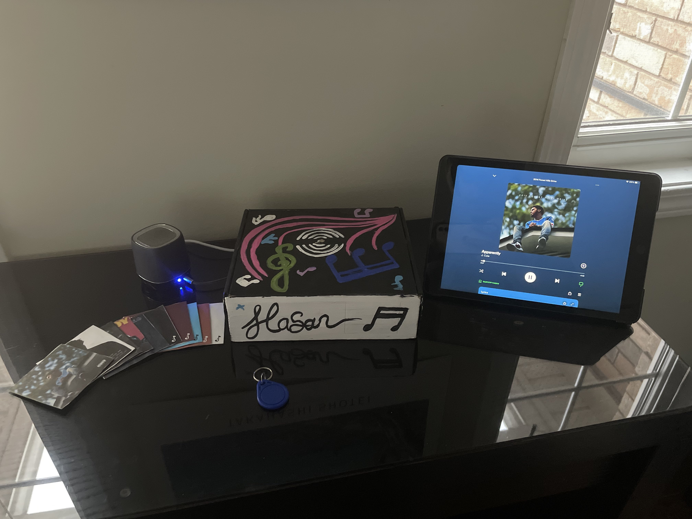

# Notely

## Modern Day Spotify Record Player Powered By RFID

Notely is a modern take on how record players could work.
Notely works by allowing the user to scan the miniature vinyl at the top of the Notely box. This will in turn play the specified song through the speakers inside the box.

### How it works:

The box contains an RFID scanner at the top and each vinyl contains a small RFID chip within it. When the vinyl is scanned on the box, it recognizes the ID and as a result plays the specified song from the box's speaker. This all works through the Spotify API and either the local, or cloud database of songs and their corresponding IDs.